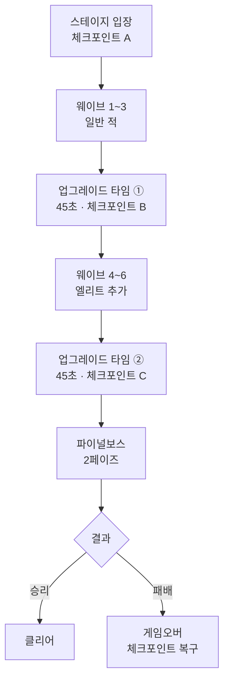

# 🎮 DUO STRIKE

**웨이브 서바이벌 협동 슈팅 게임**

진지한 척하지만 가벼운 협동 · 2인 PvE · 자원 배분과 전략적 협동

---

> **한 줄 소개**
> 웨이브를 버티며 무기를 파밍하고 강해져서 보스를 잡는 협동 슈팅. 제한된 탄약을 두 플레이어가 어떻게 나누고 활용하느냐가 전투를 가른다.

---

## 📑 목차

- [게임 개요](#-게임-개요)
- [핵심 콘셉트](#-핵심-콘셉트)
- [코어 루프](#-코어-루프)
- [캐릭터 & 스킬](#-캐릭터--스킬)
- [무기 시스템](#-무기-시스템)
- [경제 시스템](#-경제-시스템)
- [스테이지 & 보스](#-스테이지--보스)
- [적 구성](#-적-구성)
- [게임오버 & 체크포인트](#-게임오버--체크포인트)
- [전투 상태 머신](#-전투-상태-머신)
- [UI & 조작](#-ui--조작)
- [MVP 정의 & 로드맵](#-mvp-정의--로드맵)
- [개발 일정](#-개발-일정)

---

## 🎯 게임 개요

| 항목 | 내용 |
|---|---|
| **제목** | DUO STRIKE |
| **장르** | 웨이브 서바이벌 협동 슈팅 |
| **플랫폼** | PC (Steam + itch.io) |
| **엔진** | Unity 6.3 LTS (6000.3.15f1) |
| **인원** | 싱글 (MVP) / 2인 협동 (업데이트) |
| **시점** | 3인칭 탑다운 (카메라 12~15유닛 고정) |
| **배경** | 현대 / 현실 |
| **아트** | 로우폴리 |
| **분위기** | 진지한 척하지만 가벼운 협동 |
| **개발** | 1인 개발 · 파트타임 · AI 활용 |

---

## 💡 핵심 콘셉트

### 핵심 레퍼런스

| 레퍼런스 | 가져온 것 | 영향 영역 |
|---|---|---|
| **PUBG 만우절 모드 (POBG)** | 슈팅, 자원 제약(탄약), 무기 선택 | 게임플레이 근간 |
| **뱀파이어 서바이버** | 웨이브 버티기, 매판 빌드 성장, 반복 플레이 | 진행 구조 |

> 참고 레퍼런스: 헬다이버즈 2, Lethal Company (협동 시 발생하는 자연스러운 재미)

### 핵심 재미 요소

- 🎯 강한 보스를 둘이 힘을 합쳐 쓰러뜨리는 쾌감
- 🔫 무기 선택과 자원 관리의 전략 *(POBG식 슈팅)*
- 📈 무기 파밍 & 캐릭터 성장 *(뱀서식 빌드 변화)*
- 🗣️ 2인 실시간 소통 협동
- 🏆 웨이브 클리어 & 보스 도전 성취감

---

## 🔄 코어 루프

> **플레이타임:** 15~20분 / 스테이지

---

## 🏃 캐릭터 & 스킬

**기본 스탯** (MVP 캐릭터 1종): 체력 100 · 이동속도 5 · 공격력 10

### 스킬 (싱글 - MVP)

| 스킬 | 키 | 타입 | 효과 |
|---|---|---|---|
| 전술 구르기 | `Space` | 쿨타임 4초 | 대시 + 무적 (0.5초) |
| 집중 사격 | `Q` | 쿨타임 12초 | 공격력 +50%, 이동속도 -30% (5초) |
| 수류탄 | `E` | 게이지 | 마우스 위치 광역 폭발 (반경 3.5m) |

> **멀티(업데이트):** 수류탄 → **협동 공격**으로 교체 (데미지 ×2, 동시 발동 시 광역 폭발, 게이지 공유)

---

## 🔫 무기 시스템

### 주무기 (3종 · 코먼 등급)

| 무기 | 데미지 | 연사 | 사거리 | 장탄 | 재장전 | 관통률 | DPS |
|---|---|---|---|---|---|---|---|
| 소총 | 10 | 5/s | 25 | 30 | 2.0s | 15% | 50 |
| 어썰트라이플 | 7 | 8/s | 22 | 35 | 2.2s | 10% | 56 |
| 저격소총 | 30 | 1/s | 50 | 5 | 2.5s | 40% | 30 |

**무기별 역할**
- **어썰트** — 짧은 시간 고화력, 단 반동으로 탄손실 위험
- **소총** — 탄손실 적고 관통 높아 장기전 유리
- **저격** — DPS는 낮지만 관통·장거리로 안전한 포지션 딜

### 권총 (게임 시작 시 선택 · 탄약 무한)

| 종류 | 데미지 | 연사 | 장탄 | 관통 | 특징 |
|---|---|---|---|---|---|
| 리볼버 | 15 | 1.5/s | 6 | 30% | 한 방 무거움 |
| 글록 | 6 | 5/s | 17 | 15% | 다발 사격 |

> 성장 없음 · **자동 전환 없음** (수동 `2`번 키)

---

## 💰 경제 시스템

**골드 드롭** (자동 수거): 일반 5~10 / 엘리트 20~30 / 저격 15~20 / 보스 200

### 골드 상점 (업그레이드 타임 우측)

| 항목 | 가격 | 효과 | 제한 |
|---|---|---|---|
| 힐 아이템 | 60 | 보유 +1 | 최대 5개 |
| 총열 파츠 | 100 | 데미지 +10% | 1판 한정 |
| 총구 파츠 | 90 | 관통률 +10% | 1판 한정 |
| 경량 파츠 | 80 | 재장전 속도 +10% | 1판 한정 |
| 체력 강화 | 80 | 최대 체력 +20 | 1판 한정 |
| 이동속도 강화 | 80 | 이동속도 +15% | 1판 한정 |

### 무료 강화 (업그레이드 타임 좌측 · 랜덤 2개 중 1개)

`재장전 속도 -20%` · `구르기 쿨다운 -20%` · `집중사격 지속 +2초` · `수류탄 충전 +30%` · `최대 체력 +15%` · `이동속도 +10%` · `방어력 (피해 -10%)`

> **역할 분리:** 무기 성장(데미지/관통/재장전)은 상점 파츠로만 제공 → 무료 강화와 중복 없음. 체력·이동속도는 양쪽에 두어 합연산 *(의도된 설계 — 과강화 시 플레이테스트로 상한 검토)*

---

## 👹 스테이지 & 보스

**MVP:** 스테이지 1 (시가지 창고) + 보스 **브라보** (중무장 돌격대원)

### 브라보 패턴

| 패턴 | 페이즈 | 쿨다운 | 데미지 |
|---|---|---|---|
| 일반 사격 | 1 | 1초 | 50 |
| 산탄 사격 | 1 | 4초 | 30 ×3 |
| 돌진 | 1 | 8초 | 80 |
| 방어막 | 2 | 15초 (5초 지속) | - |
| 수류탄 난사 | 2 | 6초 | 60 ×3 |

> **페이즈 전환:** 체력 50% 미만 → 3초 무적 + 효과음 + 파티클 → 2페이즈
> **체력 배율:** 일반 ×1 / 엘리트 ×2.5 / 보스 ×50 *(배율은 체력에만 적용, 공격력은 고정값)*

---

## 🎯 적 구성

### MVP 3종

| 적 | 체력 | 공격력 | 이동속도 | 게이지 충전 | 행동 |
|---|---|---|---|---|---|
| 일반 보병 | 30 | 5 | 3 | +8 | 무리 돌격 + 사격 |
| 엘리트 | 75 | 12 | 3.5 | +15 | 돌격 + 회피 스텝 |
| 저격형 | 20 | 10 | 2 | +12 | 거리 유지 + 저격 |

> 방패형 적은 1차 업데이트로 추가

### 웨이브 구성 (스테이지 1)

| 웨이브 | 일반 | 엘리트 | 저격 | 패턴 | 게이지 합 |
|---|---|---|---|---|---|
| 1 | 13 | 0 | 0 | 몰아치기 | 104 |
| 2 | 9 | 0 | 3 | 분산 포위 | 108 |
| 3 | 14 | 0 | 0 | 몰아치기 | 112 |
| *업그레이드 ①* | | | | | |
| 4 | 8 | 3 | 0 | 분산 포위 | 109 |
| 5 | 5 | 4 | 2 | 몰아치기 | 124 |
| 6 | 7 | 3 | 3 | 분산 포위 | 137 |
| *업그레이드 ②* | | | | | |
| 보스 | 브라보 | | | | |

> **설계 의도:** 모든 웨이브 게이지 합 ≥ 100 → 수류탄 웨이브당 1회 보장. 후반일수록 게이지 합 증가(104→137). 웨이브 1~3은 일반 위주, 업그레이드 ① 이후 엘리트/저격 비중 증가.

---

## 💀 게임오버 & 체크포인트

### 사망 분기

| 모드 | 처리 |
|---|---|
| 스토리 (싱글) | 즉시 게임오버 화면 |
| 스토리 (멀티, 업뎃) | 동료 시점 3~5초 → 게임오버 |
| 무한 모드 (업뎃) | 즉시 종료 → 기록 화면 |

### 체크포인트 (스테이지당 3개)

| 사망 위치 | 복구 지점 | 복구 상태 |
|---|---|---|
| 웨이브 1~3 | 스테이지 입장 | 입장 시 (강화 없음) |
| 웨이브 4~6 | 업그레이드 타임 ① 직후 | ① 강화 + 1~3 보상 유지 |
| 파이널보스 | 업그레이드 타임 ② 직후 | ①② 강화 + 모든 보상 유지 |

> **복구 원리:** 체크포인트 스냅샷으로 완전 복구. 그 이후 획득/강화/소비만 사라짐.
> **게임오버 화면:** `[재도전]` 체크포인트 복구 후 재시작 / `[메뉴로]` 타이틀

---

## ⚙️ 전투 상태 머신

| 상태 | 이동 | 사격 | 재장전 | 구르기 | 힐 |
|---|---|---|---|---|---|
| IDLE/이동 | - | ✅ | ✅ | ✅ | ✅ |
| 사격 중 | ✅ | - | ✅ | ✅ | ❌ |
| 재장전 중 | ✅ | ✅ *(취소 후 사격)* | - | ✅ *(취소)* | ❌ |
| 힐 중 | ✅ *(감속)* | ❌ | ❌ | ✅ *(캔슬)* | - |
| 구르기 중 | - | ❌ | ❌ | - | ❌ |

> **우선순위:** 구르기(최우선) > 힐 > 재장전 > 사격 > 이동
> **집중 사격**은 버프라 상태와 무관하게 모든 행동과 병행 가능

### 수류탄 게이지

| 충전 소스 | 충전량 |
|---|---|
| 일반 처치 | +8 |
| 엘리트 처치 | +15 |
| 저격 처치 | +12 |
| 데미지 입힐 때 | 100당 +1 |

> 최대 100 · 웨이브당 약 1회 · 보스전은 데미지 충전으로 사용 가능

---

## 🖥️ UI & 조작

**화면 흐름:** 타이틀 → 스테이지 선택 → 권총 선택 → 게임 → 클리어/게임오버

### 키 매핑

| 키 | 동작 | 키 | 동작 |
|---|---|---|---|
| `WASD` | 이동 | `1` | 주무기 |
| `Mouse` | 조준 | `2` | 권총 |
| `LMB` | 사격 | `R` | 재장전 |
| `Shift` | 달리기 | `H` | 힐 |
| `Space` | 구르기 | `F` | 상호작용 |
| `Q` | 집중 사격 | `Tab` | 배낭 |
| `E` | 수류탄 | `ESC` | 메뉴 |

### 연출

- **보스 처치:** 쓰러지는 애니메이션 → `VICTORY` 텍스트 → 클리어 화면
- **웨이브 시작:** `WAVE N` 표시
- **무기 손맛:** 반동/흔들림 (무기별 차이) + 히트스톱 (저격 강함)
- **환경 폭발물:** 드럼통 폭발로 광역 처치
- **BGM:** 메인 메뉴 + 전투 2종 (보스전 전환 없음)

---

## 📦 MVP 정의 & 로드맵

> **MVP:** "제대로 된 싱글플레이 슈팅 게임 1개 완성"

**포함:** 스테이지 1 · 보스 1(브라보) · 적 3종 · 무기 3종 + 권총 2종 · 스킬 3개 · 골드/업그레이드 타임 · 체크포인트 · 일반 슬롯 UI

### 업데이트 로드맵

| 차수 | 내용 |
|---|---|
| **MVP** | 스테이지 1 + 보스 1 + 적 3종 + 무기 3종 + 스킬 3개 |
| 1차 | 무한 모드 + 방패형 추가 |
| 2차 | 스테이지 2 + 바이퍼 |
| 3차 | P2P 멀티 + 협동 공격 |
| 4차 | 스테이지 3 + 커맨더 |
| 5차 | 등급제 · 파츠 · 3D 배낭 · 캐릭터 2종 |

---

## 📅 개발 일정

| Milestone | 내용 | 기간 |
|---|---|---|
| 0 | 셋업 + 에셋 | 3~5일 |
| 1 | 코어 조작감 (+손맛 연출) | 1~1.5개월 |
| 2 | 무기 & 스킬 | 1~1.5개월 |
| 3 | 웨이브 시스템 (적 3종) | 1~1.5개월 |
| 4 | 보스 (브라보) | 1.5~2개월 |
| 5 | 싱글 완성 + 폴리싱 | 1개월 |

> **총 예상:** 약 6~7개월 *(현실적으로는 8~10개월)*

---

**모든 수치는 플레이테스트를 통해 지속적으로 조정되는 출발점입니다.**

*🛠️ Made by 1인 개발 · Unity 6.3 LTS*

